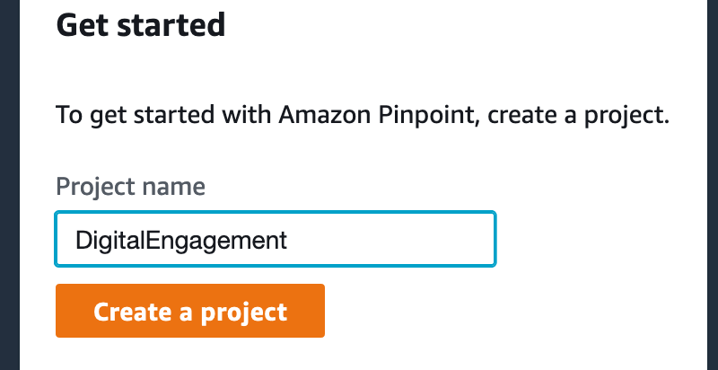

# DigitalCustomerEngagementonAWS
Digital Customer Engagement on AWS

## Using Pinpoint for engaging customer over multiple channels.
Amazon Pinpoint helps you engage with your customers by sending them email, SMS, and push notification campaigns.Amazon Web Services offers a highly scalable, low-latency, globally distributed architecture. Amazon Pinpoint is built on this architecture, allowing you to send messages to your customers through multiple channels with confidence. You can use these channels to send messages to recipients all around the world. When you send through the SMS or voice channels, your messages can be sent from local phone numbers in the recipient’s country or region.With rich analytics, easy-to-use campaign and journey tools, and multiple engagement channels, Amazon Pinpoint helps you easily reach the right customer with the right message at the right time. Amazon Pinpoint provides you with real-time data so that you can quickly provide your customers with a better engagement experience. Real-time data enables the Pinpoint API to deliver on-demand messages. You can integrate Amazon Pinpoint with other AWS services to create a solution that meets your unique needs. Use Amazon Personalize and Amazon Comprehend to generate proactive customer insights, and then send that information to Amazon Pinpoint to deliver smarter messages to your customers

### Steps for getting started with Amazon Pinpoint:

#### 1) Amazon Pinpoint 
In your preferred region/available region, search for Amazon pinpoint

#### 2) Create Project
Click Create Project and provide a name to the project

It will ask you to enable different channels, but you can skip this step for now

#### 3) Create Segment
Next step is creation of the segment. This is your target customer with whom you want to send out communication. On the left side of the project, you can see segment. You can hit “create segment” and import from S3 bucket or from your local machine. 

#### 4) Enable Channel
Lets first try the SMS channel. In the Settings on the left side, enable the SMS channel. 

#### 5) Create SMS Template. 
From the Message Template on the left, create a new template and select SMS as channel.
For this example you can specify the following:
Hello {{User.UserAttributes.FirstName}} ! There is something special waiting for you! and yes it is {{Attributes.CustomerPreference}} Login to your account now and check it!

#### 6) Create campaign
Next step is to create a campaign. On the left side of the project place, click on campaign
Create campaign—> Provide a name, Select standard campaign, SMS as channel.
Next —> Select the segment we create in the drop drop (in the previous step)
Next —>Select the SMS template which we created in previous step
Next —> keep default to immediately
Next—>Launch Template

#### 7) You should see an SMS send out as per your template.

